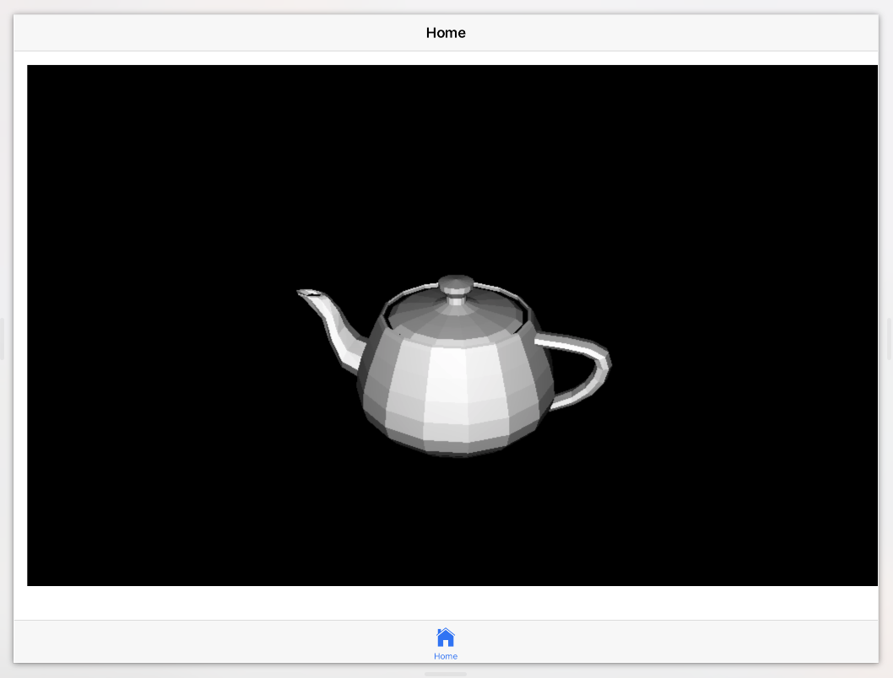

Ionic3D Proof of Concept
========================

A simple Ionic2 app displaying a STL 3D Model

## Credits

Download the Teapot STL model at <http://www.thingiverse.com/thing:616069/#files>

Based on [STLLoader.js](https://github.com/mrdoob/three.js/blob/master/examples/js/loaders/STLLoader.js) from [mrdoob/three.js](https://github.com/mrdoob/three.js)
